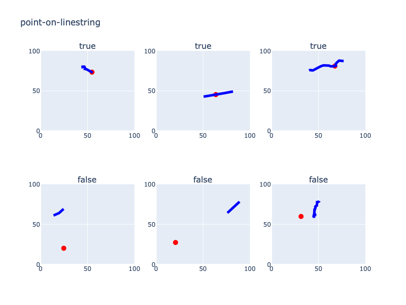
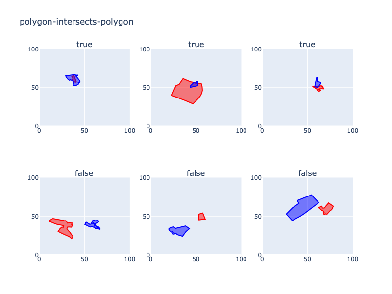

# geo-relations

### Generate datasets to test geometric relationships
	
This package generates datasets to develop and test code 
quantifying spatial relationships. 
For example, if you have something that determines whether two lines intersect,
then you can create a dataset of thousands of line pairs, some of which intersect and
some of which don't, and use that to train and test a model. 

The intended use is for models that estimate
geometric relationships based on approximate positional encodings. 
It helps answers questions like, 
"given approximate encodings for a pair of lines,
how well does my model determine whether the lines intersect?"

In order to give the data some geospatial realism, this package pulls shapes of 
various entities from OpenStreetMap. It then moves and shifts them
around in order to assure that prescribed relationships either
do or do not exist between them.

All shapes are returned within a square 2D coordinate system,
of a size that you specify, with no defined length units. 

Here is a quick example of its use.

```python
from geo_relations import ShapeHarvester
from geo_relations import RelationGenerator

center_lat, center_lon, extent = 42.631024, -70.993787, 20000.0
harvester = ShapeHarvester(center_lon, center_lat, extent)
shapes = harvester.harvest(['linestrings', 'polygons'])

generator = RelationGenerator(shapes, bounds=[0, 0, 100, 100], scale=25)
a, b = generator.generate('linestring-intersects-polygon', True)
```

At this point, `a` and `b` will be, respectively, a LineString
and a Polygon that intersect one another. Their size will be somewhere 
around 25 units, and they will be placed at a random location 
in a coordinate space from (0, 0) lower left to (100, 100) upper right.
The actual shapes will be scaled versions of
entities pulled from a 20km box centered
on the given lon/lat location.
If you want such a pair of shapes guaranteed NOT to intersect, 
call 

```python
a, b = generator.generate('linestring-intersects-polygon', False)
```


 

At this time, the types of relationships that can be generated are:
- `point-on-linestring`
- `point-in-polygon`
- `linestring-intersects-linestring`
- `linestring-intersects-polygon`
- `polygon-intersects-polygon`
- `polygon-borders-polygon`


## Examples







## Supporting packages

* `shapely`: Provides computations on geometric objects.
* `osmnx`: Used to pull shapes from OpenStreetMap. See: Boeing, G. (2024). Modeling and Analyzing Urban Networks and Amenities with OSMnx. Working paper. https://geoffboeing.com/publications/osmnx-paper/

## Installation

```python
pip install geo-relations
```

## Release History

* 1.0.0: Coming soon

## Author and maintainers

* John Collins -- `john@odyssey-geospatial.com`

## Contributing

1. Fork the repo (https://github.com/yourname/yourproject/fork)
2. Create your feature branch (git checkout -b feature/fooBar)
3. Commit your changes (git commit -am 'Add some fooBar')
4. Push to the branch (git push origin feature/fooBar)
5. Create a new Pull Request
